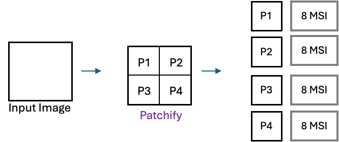

## ArtExtract 🎨 

#### 1. Project overview
The ArtExtract project leverages machine learning to revolutionize art conservation by uncovering hidden paintings through multispectral imaging. By creating a comprehensive dataset of multispectral images of paintings, the project aims to develop an AI model capable of detecting hidden artworks behind the canvas. The project's innovative techniques could lead to significant discoveries in art history. Initially, the focus is on generating high-quality multispectral images from RGB images, addressing the challenges and strategic approaches needed to achieve this goal.

#### 2. Model Structure
<!-- Model architecture image and explanation will be added -->
2.1 Multispectral Image (MSI) Generation 

2.2 Hidden Painting Extraction


#### 3. Dataset 
| Dataset  | Info | Link |
| ------------- | ------------- |------------- |
| CAVE  | 32 scenes with full spectral resolution reflectance data from 400-700nm at 10nm intervals | [Link](https://www.cs.columbia.edu/CAVE/databases/multispectral/)  |
| Harvard | 50 indoor and outdoor images, with 25 images featuring mixed illumination  | [Link](https://vision.seas.harvard.edu/hyperspec/d2x5g3/)  |
| Multispectral Imaging (MSI) | 2 mock-up paintings with multispectral data at 360–1150 nm intervals| [Link](https://projects.ics.forth.gr/cvrl/msi/)  |

Among the multispectral dataset mixed with different objects, we chose painting images as a validation dataset to verify its robust performance to align with our reserach objectives.

| Data  | CAVE  | Harvard |MSI |Total  GT Image | Multispectral Masks|
| ------------| ------------- |------------- |  ------------- |------------- |------------- |
|Train|25|77|0|102|102*8|
|Val|2|0|2|4|4*8|

To overcome the limited training dataset, we created [patchify.py](utils/patchify.py), which divides a single image into 4 smaller patches. This process increases the size of the training dataset by a factor of 4, effectively augmenting the existing data and enhancing the model's training potential.


- Dataset Structure
 ```               
├── train 
│   │
│   ├── rgb_images  # RGB images for training including objects and scenaries                      
│   └── ms_masks    # 8 multispectral images per 1 rgb image
└── val 
    ├── rgb_images  # Allocated painting image                       
    └── ms_masks  
```

Download train/val dataset used for the study [here.](https://drive.google.com/drive/folders/1tW_GlgvikZlo6fHXr8Sjq1yrLTHw4tSz?usp=share_link)
#### 4. Results
4.1 Quantitative Analysis

| Model  | PSNR  | LPIPS |SSIM |
| ------------| ------------- |------------- |  ------------- |
| TBD  | TBD  | TBD |TBD |

4.2 Qualitative Analysis
<!-- Visualized output image using best model -->
<!--Painting validation dataset output - extract, generated output -->

#### 5. Implementation guidance

- Directories
```                
├── unets               # Collection of different UNets            
│   ├── transBlocks     # Chunks of Transformer blocks          
│   └── ..       
├── utils               # For the data loading, eval metrics and visualization, create patches
├── model.py            # Best performing model       
├── train.py            # Train, test code       
└── trainModel.ipynb    # Example 
``` 

Step 1. Install the required packages
```
pip install -r requirements.txt
```
Step 2. Train the model 
```
<!-- Example -->
python train.py --trainpath  '../train/' --valpath '../val/' -lr 0.02 -e 100
```


Find out more about the project on this [blog]([https://medium.com/@soyoungpark.psy](https://medium.com/@soyoungpark.psy/beneath-the-canvas-discovering-hidden-art-with-ai-part1-gsoc-24-3dc499758120))! 
